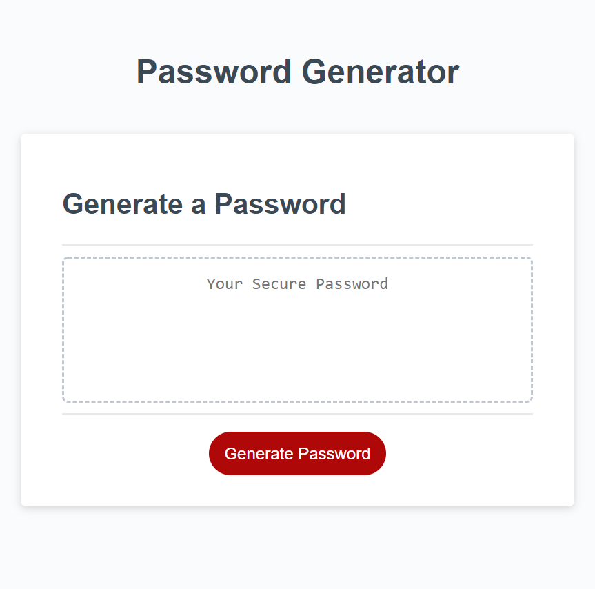

# password-generator

## Task
 I created a functional random password-generator, by using Functions() Loops() and Var(). I also made loops where if the user didn't put the correct answer for certain choices they will stay in the loop until they do.

 ## Resources

 I used the various sources below to complete this task. I also had very good help from my classmates Neema and Vidal.

https://www.w3schools.com/jsref/met_win_confirm.asp

https://www.w3schools.com/js/js_loop_while.asp

https://www.w3schools.com/jsref/jsref_tostring_string.asp

https://stackoverflow.com/questions/27936267/how-to-hide-an-element-depending-on-a-boolean-variable
https://stackoverflow.com/questions/23097859/javascript-prompt-validation

https://www.w3schools.com/js/js_comparisons.asp

## Final Product

## Links

[Github pages](https://github.com/GustavoTijerino1/password-generator)

[Official Website](https://gustavotijerino1.github.io/password-generator/)